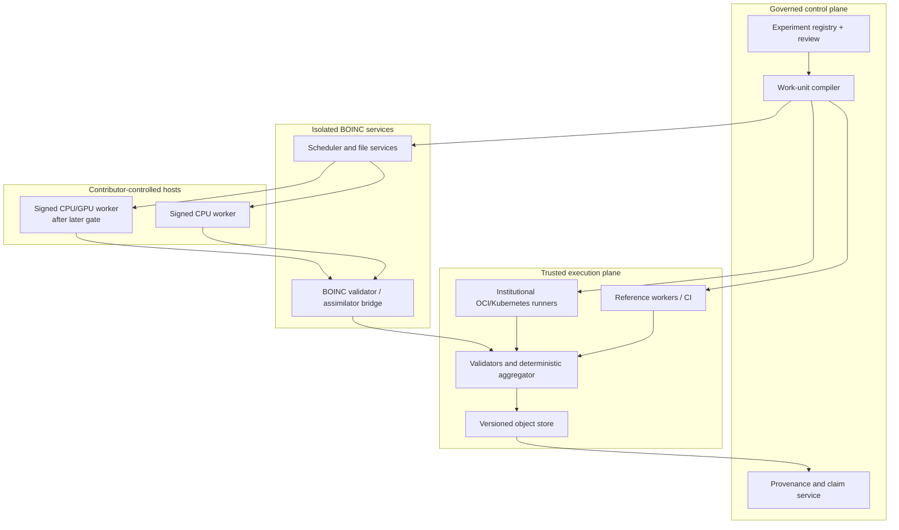

# Architecture

## Decision summary

Voynich@Home uses a transport-independent science engine with several runner
adapters:

- local and CI execution for development and reproduction;
- OCI/Kubernetes execution on trusted project or institutional infrastructure;
- BOINC for invitation-only and, after all gates pass, public volunteer
  execution.

The project should not build a new public volunteer client for v1. BOINC already
provides host onboarding, scheduling, retries, checkpoint integration, CPU/GPU
capability matching, user resource preferences, replication, validation, and
application release mechanics. Custom work should concentrate on experiment
quality and evidence provenance.

## Trust and deployment boundaries



Volunteer hosts and their outputs are untrusted. Researchers do not submit
executables to BOINC. They submit declarative experiment plans; an approved
worker release interprets a bounded workload contract.

## Components

### 1. Source and corpus registry

Stores content digests, origin, retrieval metadata, rights status, attribution,
and deterministic transformation lineage. Source payloads live in rights-aware,
content-addressed storage rather than Git. A corpus snapshot never means
“whatever the URL returns today.”

### 2. Experiment registry

Maintains the append-only lifecycle in the research protocol. Registration
freezes the analysis plan, review records, software requirements, compute budget,
and maximum claim tier. Amendments create linked successor records.

### 3. Work-unit compiler

Expands one registered experiment into deterministic, bounded work units. The
same compiler output is accepted by every runner adapter. Generation itself is
reproducible: identical plan, corpus digests, compiler version, and seed produce
identical identities and ordering.

### 4. Worker runtime

Consumes local input files and one work-unit document, then writes one result
envelope. The scientific kernel has no network requirement, no ambient secrets,
and no scheduler-specific logic. It periodically writes versioned checkpoints
whose restart frequency cannot change the final result.

The first reference worker is single-threaded CPU code. Optimized threads,
SIMD, and accelerators are separate application profiles whose equivalence is
tested against the reference.

### 5. Runner adapters

Adapters translate dispatch, progress, checkpoint, and result transfer without
changing scientific identity:

- `local`: subprocesses on a workstation;
- `ci`: small golden vectors and contract fixtures;
- `trusted-oci`: institutional batch or Kubernetes Jobs pinned by image digest;
- `boinc`: native signed application versions and BOINC work/result templates.

Kubernetes is an internal batch substrate, not a volunteer network. Volunteer
machines must never join the project cluster.

### 6. Validator and aggregator

The validator compares independent result envelopes under a registered exact or
tolerance rule. The aggregator consumes only canonical validated records,
processes them in a fixed order, and produces content-identified findings. Both
are versioned scientific software.

### 7. Provenance and claim service

Publishes a human report beside machine-readable manifests, control outcomes,
validation history, full search denominators, energy estimates, limitations,
and reproduction commands. It enforces claim-tier wording rather than inferring
scientific truth from a leaderboard.

## Work-unit identity contract

The identity document includes:

- schema and work-unit compiler versions;
- experiment, registration, corpus snapshot, and corpus-view digests;
- worker source/build/artifact and output-schema digests;
- exact parameter slice or key range;
- input artifact names, sizes, media types, and SHA-256 digests;
- explicit RNG algorithm, seed derivation, and stream/counter range;
- numeric profile, sorting and tie-breaking rules, locale, and thread constraints;
- validator version and exact/tolerance equivalence rule;
- CPU, memory, disk, output-size, checkpoint, and deadline ceilings;
- control/partition role and aggregation stratum.

Identity bytes use [RFC 8785 JSON Canonicalization](https://www.rfc-editor.org/rfc/rfc8785)
before SHA-256 hashing. The `work_unit_id` is the digest of the identity object
without the `work_unit_id` member itself. Files are verified again inside the
worker even when a transport has its own checksum.

The prototype in this branch exercises that contract with synthetic examples.
Production contracts will add signed envelopes and compatibility test vectors
without mutating v1 records.

## Execution semantics

All adapters are treated as **at least once**:

- duplicate execution is expected;
- result upload and assimilation are idempotent by content digest;
- leases and deadlines affect scheduling, not scientific identity;
- checkpoints contain complete algorithm and RNG state;
- cancellation records why a unit stopped and never converts a partial output
  into a complete result;
- late results are retained for reliability analysis but do not silently change
  a published canonical result.

Prefer deterministic integer sufficient statistics and perform sensitive
floating aggregation on trusted reference infrastructure. When floating point
is necessary, pin numeric profiles and validate within demonstrated equivalence
classes; use BOINC homogeneous redundancy only as an additional mechanism, not a
substitute for stability testing.

## Initial validation policy

During calibration and the invitation-only pilot:

1. Dispatch two replicas to different hosts and, where feasible, different users.
2. Accept exact or registered-tolerance `2-of-2` agreement.
3. On disagreement, dispatch a third and require `2-of-3`.
4. Fully replicate every new worker version and hardware profile.
5. Randomly audit agreeing work on controlled reference hardware.
6. Replay every shortlisted scientific candidate with the reference worker.

Adaptive replication may reduce overhead only after measured error rates and a
registered audit rate support it. Agreement between hosts validates execution;
it does not validate the underlying hypothesis.

## BOINC integration

The BOINC adapter should use:

- pinned application versions;
- signed, single-purpose native workers first;
- platform and plan classes for tested CPU/GPU profiles;
- bounded work/result templates and upload certificates;
- application-specific validators and assimilators;
- conservative project-level volunteer preferences;
- canary and beta channels before production release;
- a bridge that commits the complete provenance bundle before BOINC database
  purging removes live work/result rows.

The current BOINC Central custom-application path uses BOINC Universal with
Docker-based workloads. That does not satisfy this proposal's native-first
volunteer baseline by itself. A Central invitation pilot is compatible only if
the service and project can arrange an equally strong reviewed, signed,
single-purpose release path; otherwise the first invitation pilot should use an
isolated project-operated BOINC deployment. This compatibility question is an
explicit gate, not an implementation detail.

Do not send BOINC Universal Docker workloads to public volunteers in the initial
design. BOINC documents application-version signing, while the Universal Docker
model places Dockerfiles and science executables in work-unit files; therefore a
separate offline-signed workload manifest and verifying wrapper would be required
to provide equivalent release assurance. Trusted OCI runners remain useful for
reference and institutional compute.

## Suggested repository evolution

```text
contracts/             Canonical schemas and compatibility vectors
corpus/                Importers, aligners, and view transformations
experiment/            Registry client and work-unit compiler
workers/reference/     Auditable deterministic implementations
workers/optimized/     Profile-specific kernels after equivalence gates
validator/             Execution validation and deterministic aggregation
adapters/local/        Workstation and CI execution
adapters/trusted_oci/  Institutional batch execution
adapters/boinc/        BOINC templates, validator, and assimilator bridge
portal/                Experiment, provenance, and finding presentation
benchmarks/            Versioned generators; sequestered keys live elsewhere
ops/                   Deployment, signing, observability, and runbooks
docs/                  Protocols, governance, decisions, and reports
```

This branch starts with the contracts and documentation because they define
interoperability and scientific meaning before implementation choices harden.

## Build-versus-adopt rule

Reconsider a custom public client only if a measured, scientifically necessary
requirement cannot be met by BOINC after a prototype. Convenience, aesthetics,
or unfamiliarity with BOINC are not sufficient reasons to inherit the risk of
building cross-platform sandboxing, updates, resource controls, and untrusted-
host validation from scratch.
