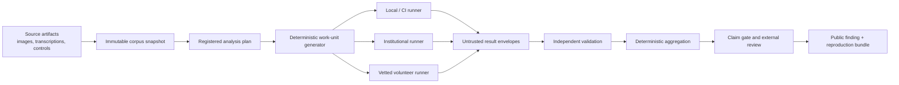

> Historical design. Superseded by [the current design](../DESIGN.md). Claims and roles below describe an earlier draft, not the current project.

# Voynich@Home Blueprint

**Proposal:** build a local-first, transport-independent system for falsifying
registered Voynich hypotheses; earn the right to distribute compute only after
known-answer recovery, false-positive, security, and energy gates pass.

This is a research infrastructure project with a volunteer-computing capability,
not a brute-force decoder with a website attached.

## Mission

Increase humanity's reliable knowledge about Beinecke MS 408 by making broad
hypothesis searches scientifically auditable, computationally reproducible, and
safe for volunteer contributors.

The mission includes well-supported negative results. It does not require a
decipherment to succeed.

## Public-interest charter

Voynich@Home will:

1. Preserve observations and uncertainty before normalization.
2. Separate hypothesis generation from confirmatory evaluation.
3. Register primary metrics, controls, partitions, and stopping rules before
   large searches begin.
4. Publish complete experiment manifests and negative findings, subject only to
   source rights and narrowly defined security embargoes.
5. Treat every volunteer result as untrusted until independently validated.
6. Minimize data collection from volunteer hosts and give contributors explicit
   CPU, GPU, battery, thermal, network, disk, and schedule controls.
7. Allocate compute through transparent scientific review and useful-work-per-
   joule estimates.
8. Apply the same evidence rules to human- and AI-generated hypotheses.
9. Prohibit cryptocurrency, transferable rewards, covert workloads, and claims
   of Yale or scholarly endorsement.
10. Reserve “solved” for independent convergence among cryptographic,
    linguistic, paleographic, codicological, and historical evidence.

## The central design decision

The science engine and the distribution mechanism are separate. An experiment
is first a deterministic local contract. A runner adapter may later execute its
work units in CI, on institutional compute, on a managed BOINC service, or on a
dedicated BOINC project. No scientific record depends on one scheduler.

This gives the project three advantages:

- researchers can reproduce any unit without joining a volunteer network;
- scientific development is not blocked by public infrastructure operations;
- the project can change distribution technology without changing experiment
  identity or evidence.

## Evidence pipeline

## Research portfolio

The platform should support bounded families rather than one universal
`decipher()` search:

- transcription and segmentation sensitivity;
- image-to-transcription alignment and scribal variation;
- structural statistics by folio, locus, layout, hand attribution, and Currier
  stratum;
- period-plausible cipher, code, abbreviation, null, and transposition models;
- syllabic, multi-glyph, and stateful encoding models;
- generative and non-linguistic production mechanisms;
- language-family comparison only when genre-, period-, script-, and
  preprocessing-matched controls are available;
- multimodal hypotheses that make registered predictions linking text and
  illustration regions.

Large language models may help formulate or implement hypotheses. They may not
serve as the sole semantic judge, conceal their model/version/prompts, or bypass
the same controls and holdouts.

## The first product is a benchmark, not a search

The initial benchmark must show that the platform can distinguish signal from
seductive noise:

1. **Integrity tasks:** retrieve, hash, parse, and round-trip source artifacts
   without silently discarding ambiguous readings.
2. **Reproduction tasks:** reproduce a reviewed set of published descriptive
   measurements across more than one transcription.
3. **Known-answer tasks:** recover hidden keys or generators from period-relevant
   plaintexts enciphered under recorded systems and noise models.
4. **Specificity tasks:** reject wrong languages, wrong cipher families,
   shuffled texts, fitted pseudo-text, and decoy correlations.
5. **Robustness tasks:** repeat conclusions under alternate segmentation,
   transcription, folio grouping, and deterministic hardware profiles.
6. **Cost tasks:** measure wall time, peak memory, bytes transferred, and energy
   proxy per useful validated candidate.

The benchmark is versioned and never replaced in place. After it influences
design, a new sequestered benchmark version is created for confirmation.

## Delivery sequence

### Gate 0 — foundation

Adopt the charter, vocabulary, governance, source registry, rights policy,
analysis-plan contract, security threat model, and claim policy. Recruit domain
reviewers before making interpretive choices about the manuscript.

### Gate 1 — local reference engine

Implement importers, corpus snapshots, experiment registration, work-unit
generation, a reference worker, validation, aggregation, and reproduction
bundles. Every path runs on one laptop with synthetic fixtures.

**Exit:** two independent machines reproduce byte-identical integer outputs and
predeclared-tolerance floating outputs from the same bundle.

### Gate 2 — scientific calibration

Run the benchmark suite, publish false-positive rates, conduct an adversarial
red-team challenge, and freeze benchmark v1.

**Exit:** known-answer recovery and negative-control thresholds are met on a
sequestered set; failures and exclusions are published.

### Gate 3 — invitation-only distribution

Use a runner adapter with tens—not thousands—of consenting hosts. Exercise code
signing, release approvals, revocation, quotas, validation quorum, privacy
retention, and incident response.

**Exit:** independent security review, zero unresolved high-severity findings,
stable validation rates, measured energy value, and a rehearsed emergency stop.

### Gate 4 — public volunteer project

Open only approved workload classes, publish live provenance and energy
estimates, and add GPU applications only where benchmarked speed and energy
benefits justify separate complexity.

**Exit:** an external scientific advisory group and a volunteer representative
approve public operations; the first production experiment is already
preregistered and locally reproducible.

## Initial 90-day outcome

The achievable first milestone is not “decode the Voynich manuscript.” It is:

- a rights-reviewed, content-addressed corpus manifest with at least two
  transcription sources represented as distinct views;
- a synthetic historical-cipher benchmark with locked answers;
- one complete registered experiment divided into deterministic work units;
- independent result validation and deterministic aggregation;
- a public reproduction bundle and report containing both successes and
  failures;
- a go/no-go decision for a small compatible managed or isolated BOINC pilot.

Detailed weekly work packages and exit tests are in
[docs/BUILD_PLAN.md](docs/BUILD_PLAN.md).

## Definition of program success

Voynich@Home succeeds if an independent team can take any published finding and
answer, without private correspondence:

- exactly which observations and editorial choices were used;
- exactly which hypotheses and parameter ranges were tried;
- which metrics were primary and how many comparisons were made;
- how positive, negative, and adversarial controls behaved;
- what software and hardware-equivalence rules produced the result;
- whether the result survives grouped confirmation data;
- what failed and what remains outside the claim.

If a candidate interpretation eventually survives those questions and external
domain review, distributed computation will have helped. If none does, the
project will still leave a reusable map of tested possibilities rather than
another pile of unrepeatable claims.
